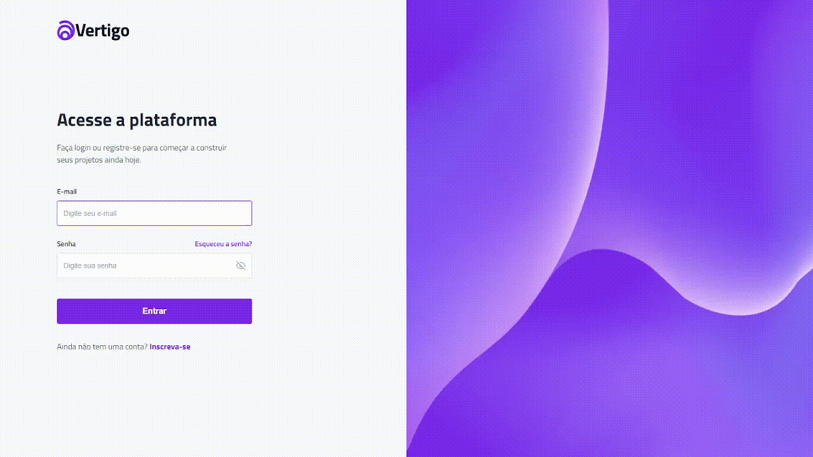
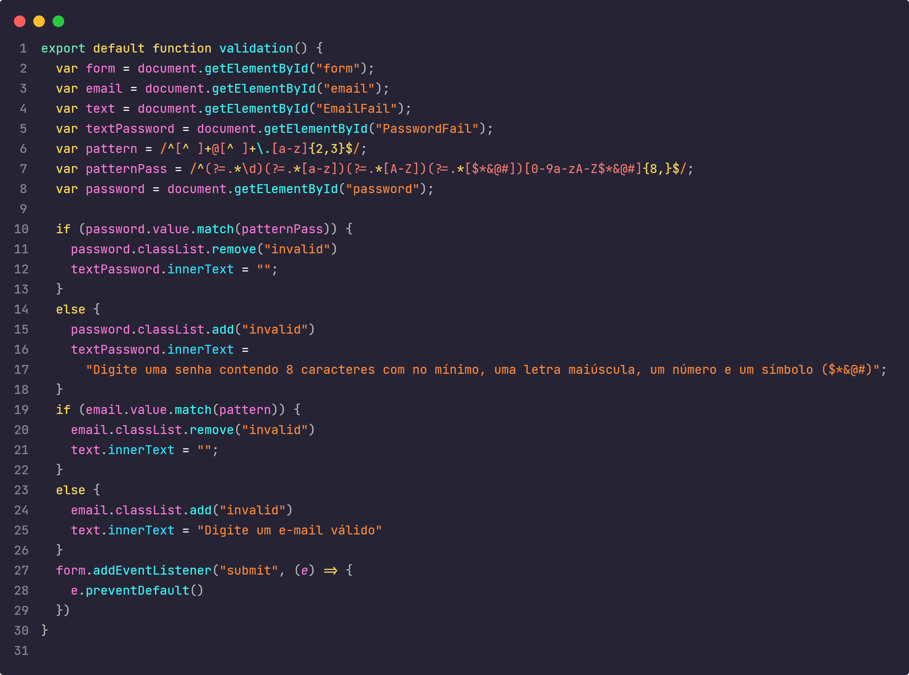
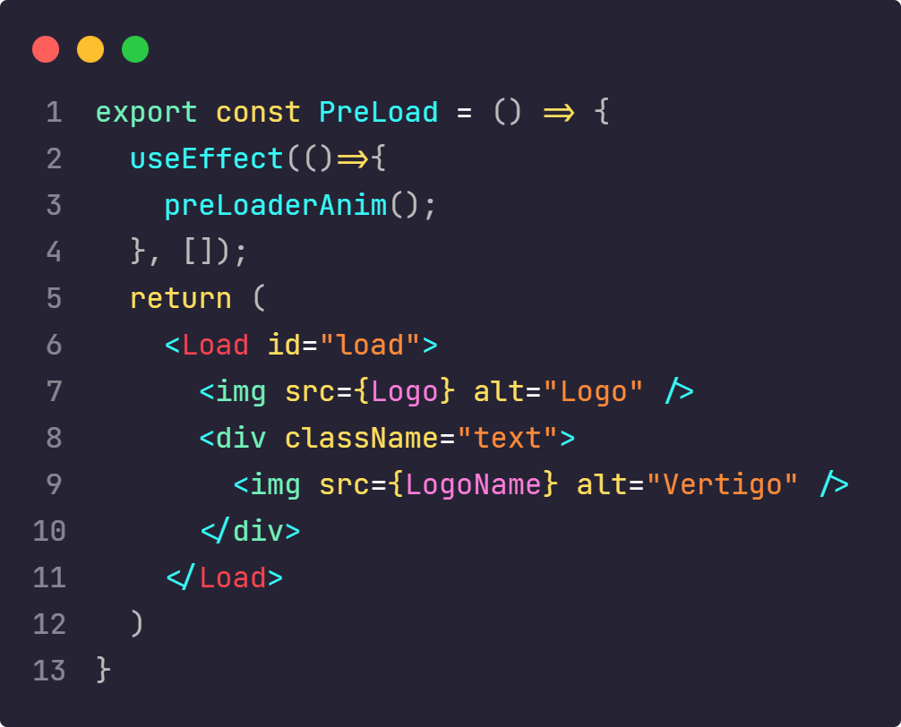

<h1 align="center">Bora Code 11</h1>

  
  
  

## Documentação
  - <a href="#projeto">Projeto</a>
  - <a href="#diario"> Diário de bordo </a>
  - <a href="#estrutura"> Estrutura do Projeto</a>
    - <a href="#stacks"> Stacks</a>
    - <a href="#stacks"> Cores</a>
    - <a href="#wakatime"> Distribuição do Tempo</a>
    - <a href="#page"> PageSpeed Insights</a>
  - <a href="#melhorias"> Melhorias</a>
  - <a href="#destaque">Destaque para alguns códigos</a>

<h2 id="projeto"> Projeto </h2>

> Bora codar 11, nesse desafio desenvolve uma pagina de login <a href="" >Link para o resultado</a>

<h2 id="diario"> Diário de bordo </h2>
<table>
  <thead>
        <tr>
            <th align="center">
                 
                

                    <small>DATA</small>
                

            </th>
            <th align="center">
                 
                
 
                    <small>
                        TAREFA
                    </small>
                

            </th>
            <th align="left">
                
                
 
                    <small>
                     TEMPO
                    </small>
                

            </th>
            <th align="center">
                
                
 
                    <small>
                      COMMITS
                    </small>
                

            </th>
        </tr>
    </thead>
    <tbody>
        <tr>
            <td>16/03</td>
            <td><a href="#estrutura">Estruturação e Responsividade</a></td>
            <td>2h</td>
            <td align="center">
            <a href="#commits">1</a></td>
        </tr>
        <tr>
            <td>17/03</td>
            <td><a href="#estrutura">Finalização +deploy</a></td>
            <td>2h 5m</td>
            <td align="center">
            <a href="#commits">1</a></td>
        </tr>
    </tbody>
</table>

<h2 id="estrutura"> Estrutura do Projeto </h2>

<h3 id="stacks"> Stacks utilizadas </h3>
  <strong>Gsap,  <strong>
  <strong>Google Fonts,<strong>
  <strong>Figma,<strong>
  <strong>Wakatime<strong>
  <strong>Pagespeed<strong>
  
<h3 id="cores">Cores do Projeto</h3>

| Cor               | Hexadecimal                                                |
| ----------------- | ---------------------------------------------------------------- |
| Purple      |  #7c3aed |
| Gray 50      |  #f8fafc |
| Gray 100      |  #f1f5f9 |
| Gray 200     |  #e2e8f0 |
| Gray 300     |  #cbd5e1 |
| Gray 400     |  #94a3b8 |
| Gray 500     |  #64748b|
| Gray 600     |  #475569 |
| Gray 700     |  #334155 |
| Gray 800     |  #1e293b |
| Gray 900     |  #0f172a |

<h3 id="wakatime">Tempo distribuido em linguagens </h3>

| # | Tempo         | linguagem                                      |
|--| ----------------- | ---------------------------------------------------------------- |
| # |  3h 35m | JavasScript (react) |
| # | 30m | css (index.css)|

<h3 id="page">PageSpeed Insights</h3>
Dados do computador 
 
Dados para os dispositivos movéis 

<h2 id="melhorias"> Melhorias ao Projeto</h2>

- Ligação a um banco de dados
- Requisão de imagens do banco
- Uma página para a função esqueceu sua senha 
- Botão para permacer conectado

<h2 id="destaque">Destaque para alguns códigos</h2>

## Licença

[MIT](./LICENSE)

